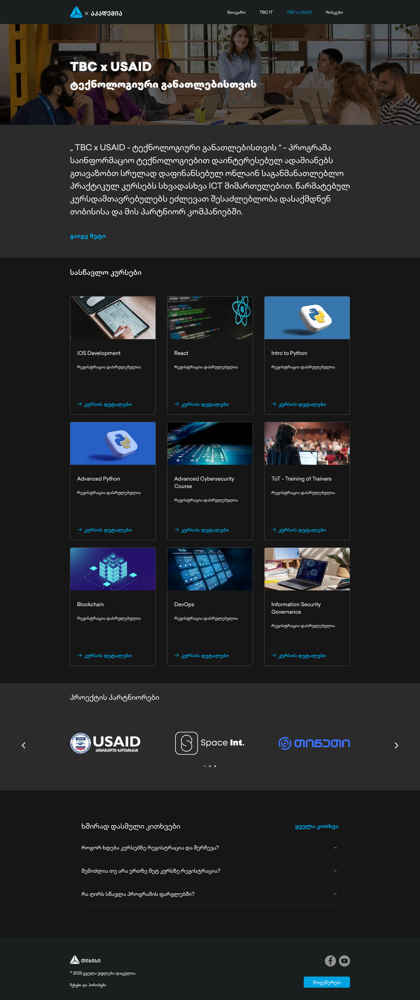

# TBC x USAID Page

This is a copy of the [https://www.tbcacademy.ge/usaid](https://www.tbcacademy.ge/usaid) page.

## Table of contents

- [Screenshot](#screenshot)

- [Folder Structure](#folder-structure)

- [Links](#links)

- [Built with](#built-with)

- [How to launch](#how-to-launch-the-website)

- [Author](#author)

### Screenshot



## Folder Structure

```
│   index.html
│   index.js
│   README.md
│   styles.css
│
├───assets
│   │   index-ogrnSLTc.js
│   │   index-umXxCgmL.css
│   │   logo-wFJ7pbIq.svg
│   │   space-U6DAJxIy.webp
│   │   spectre-OE65WpQ1.webp
│   │   tbc-body-HwrImiNc.woff2
│   │   tbc-button-1-uBCVeq8F.woff2
│   │   tbc-head-wSxjTWra.woff2
│   │   tbc-q-gBHyO1.webp
│   │   tegeta-iymoyu1Y.webp
│   │   tnet-y8mgfybJ.webp
│   │   ufc-Xjm_CAWk.webp
│   │   usaid-tWwbuRGa.webp
│   │
│   ├───data
│   │       courses.json
│   │
│   ├───fonts
│   │       tbc-body.woff2
│   │       tbc-button-1.woff2
│   │       tbc-button-2.woff2
│   │       tbc-head.woff2
│   │
│   └───images
│       │   arrow-right.svg
│       │   bars.svg
│       │   caret-down.svg
│       │   caret-up.svg
│       │   footer-logo.webp
│       │   logo.svg
│       │   socials-fb.webp
│       │   socials-ytb.webp
│       │
│       └───slider-pics
│               bracket-left.svg
│               bracket-right.svg
│               README.md
│               space.webp
│               spectre.webp
│               tbc.webp
│               tegeta.webp
│               tnet.webp
│               ufc.webp
│               usaid.webp
│
├───public
│   ├───data
│   │       courses.json
│   │
│   └───images
│           arrow-right.svg
│
└───src
    │   carousel.js
    │   courses.js
    │   faq-section.js
    │   navbar.js
    │
    └───utilities
            checkIfScrolled.js
            fetchLocalData.js
            getElement.js
```

### Links

- [Github Repo](https://github.com/beqarion/3-column-preview-card-component)

- [Github Repo(Vanilla side project)](https://github.com/beqarion/3-column-preview-card-component)

- [Live](https://tbcxusaidassignment.netlify.app/)

### Built with

- Semantic HTML5 markup

- Vanilla JS

- CSS custom properties

- Flexbox

- CSS Grid

- Built with Vite

### How to Launch the Website

Follow these steps to get the project up and running on your local machine:

#### 1. Clone the Repository

```bash
git clone https://github.com/beqarion/tbcxusaid.git
```

#### 2. Navigate to the Project Directory

```bash
cd tbcxusaid
```

#### 3. Install Dependencies

```bash
npm install
```

#### 4. Run the Development Server

```bash
npm run dev
```

## Author

- GitHub - [@beqarion](https://github.com/beqarion)
